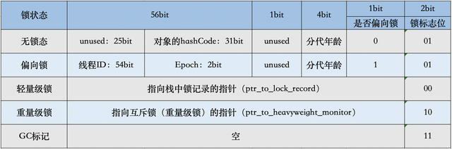

```java
class Demo{
        public static void main(String[] args) throws InterruptedException {
            Object obj = new Object();
            //查看对象内部信息
            System.out.println(ClassLayout.parseInstance(obj).toPrintable());

            new Thread(() -> {
                //思考：Demo.class会是什么状态？
                synchronized (Demo.class) {                   
                    System.out.println(Thread.currentThread().getName() + " \n " + ClassLayout.parseInstance(Demo.class).toPrintable());
                    //
                }
                synchronized (obj) {
                    System.out.println(Thread.currentThread().getName() + " \n " + ClassLayout.parseInstance(obj).toPrintable());
                }
            }, "Thread1").start();

            //00000001 无锁
            //01000000 轻量级锁
            //
            /**
             java.lang.Object object internals:
             OFFSET  SIZE   TYPE DESCRIPTION                               VALUE
             0     4        (object header)                           01 00 00 00 (00000001 00000000 00000000 00000000) (1)
             4     4        (object header)                           00 00 00 00 (00000000 00000000 00000000 00000000) (0)
             8     4        (object header)                           e5 01 00 f8 (11100101 00000001 00000000 11111000) (-134217243)
             12     4        (loss due to the next object alignment)
             Instance size: 16 bytes
             Space losses: 0 bytes internal + 4 bytes external = 4 bytes total

             Thread1 
             java.lang.Object object internals:
             OFFSET  SIZE   TYPE DESCRIPTION                               VALUE
             0     4        (object header)                           40 f6 70 1f (01000000 11110110 01110000 00011111) (527496768)
             4     4        (object header)                           00 00 00 00 (00000000 00000000 00000000 00000000) (0)
             8     4        (object header)                           e5 01 00 f8 (11100101 00000001 00000000 11111000) (-134217243)
             12     4        (loss due to the next object alignment)
             Instance size: 16 bytes
             Space losses: 0 bytes internal + 4 bytes external = 4 bytes total
             */

            
        }
}

```
